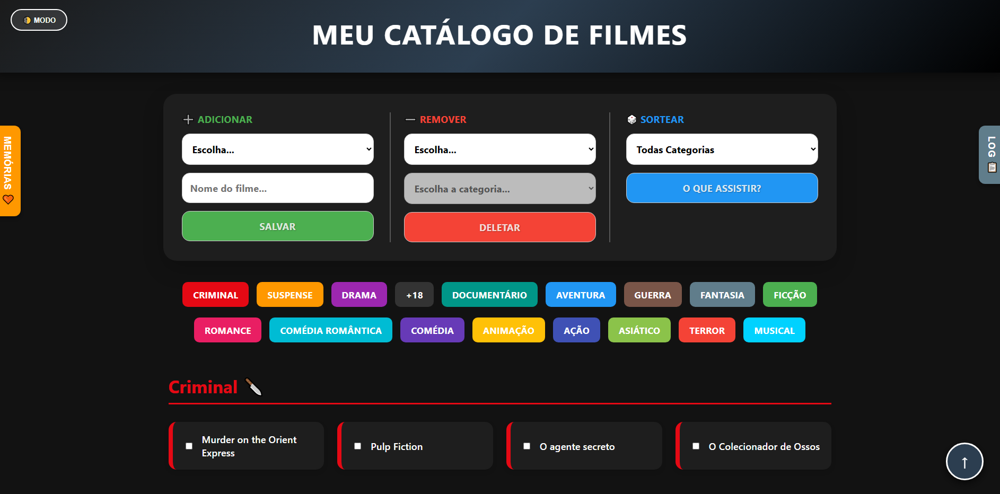

# 🎬 Movie Manager: Catálogo Inteligente & Sorteador

O **Movie Manager** é uma aplicação interativa de página única (**SPA**) projetada para o gerenciamento pessoal de acervos cinematográficos. O projeto une a robustez da estruturação de dados em **Python** (utilizado para o setup inicial) com a agilidade de uma interface reativa em **JavaScript**, focando em persistência *client-side* e uma experiência de usuário (UX) fluida.

---

## 🚀 Funcionalidades de Destaque

* **Gerenciamento Dinâmico (CRUD):** Interface intuitiva para adição e remoção de títulos por categoria com atualização instantânea da interface.
* **Sorteador Inteligente:** Algoritmo que filtra filmes marcados como "vistos", garantindo sugestões apenas de conteúdos inéditos.
* **Persistência Local:** Implementação da **Web Storage API (LocalStorage)**, garantindo que sua lista, preferências de tema e histórico permaneçam salvos no navegador.
* **Histórico de Logs & Memórias:** Sistema integrado para acompanhar adições, remoções e revisitar filmes assistidos.
* **UI/UX Refinada:**
    * **Modo Escuro/Claro:** Alternância dinâmica de temas com persistência da preferência.
    * **Navegação Fluida:** Menu de âncoras inteligente que facilita o acesso rápido às categorias em catálogos extensos.
    * **Identidade Visual:** Design minimalista e responsivo, com cards estilizados por cores específicas para cada gênero.

---

## 🛠️ Tecnologias Utilizadas

* **JavaScript (ES6+):** Motor de interatividade, manipulação do DOM e gerenciamento de estado via LocalStorage.
* **HTML5 & CSS3:** Estruturação semântica e estilização avançada utilizando Variáveis CSS, Flexbox e CSS Grid.
* **Python:** Utilizado no back-end para organização estrutural dos dados iniciais e automação do catálogo.

---

## 📦 Como Executar o Projeto

Como o projeto utiliza persistência local e arquivos modulares, a melhor forma de visualizar é:

1.  Clone este repositório:
    ```bash
    git clone [https://github.com/SEU-USUARIO/catalogo-filmes.git](https://github.com/SEU-USUARIO/catalogo-filmes.git)
    ```
2.  Navegue até a pasta do projeto e abra o arquivo `index.html` em seu navegador de preferência.
3.  **Dica:** Para uma experiência completa, certifique-se de que os arquivos `style.css` e `script.js` estejam na mesma pasta que o `index.html`.

---

## 📸 Preview

<div align="center">
  
  <p><i>Interface principal do Movie Manager</i></p>
</div>

---

## 👤 Autor

**Rafael Ziani** - [GitHub](https://github.com/steinbukken7321)